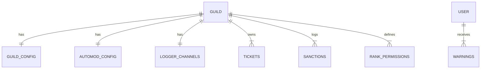

# Architecture Technique : Bot-Protect "uhq-monde" (v3.0.0)

> **Type** : Brownfield (Documentant un système existant)
> **Stack** : Node.js, Discord.js v14, SQLite (better-sqlite3)

## 1. Vue d'Ensemble du Système
Le bot "uhq-monde" est une application monolithique Node.js agissant comme un bot de modération et de protection ultra-sécurisé pour serveurs Discord. Il utilise une architecture basée sur les événements (Event-Driven) classique pour les bots Discord.

### Diagramme de Contexte
```mermaid
graph TD
    User[Utilisateur Discord] -->|Intéragit via Commandes/Événements| DiscordAPI[Discord API]
    DiscordAPI -->|Websockets (Gateway)| BotProcess[Processus Node.js Bot]
    BotProcess -->|CRUD| SQLiteDB[(Database SQLite)]
    BotProcess -->|Logs| LogChannels[Salons de Logs Discord]
```

## 2. Composants Principaux (`src/`)

### 2.1 Core (`src/core/`)
- **`index.js`** : Point d'entrée. Initialise le `NamiClient` et charge les variables d'environnement (`.env`).
- **`client.js`** : Extension de la classe `Client` de Discord.js. Charge les handlers.
- **`envLoader.js`** : Validation stricte des variables critiques (`TOKEN`, `OWNER_ID`).

### 2.2 Module de Sécurité (`src/security/`)
Le cœur de la proposition de valeur "Protection".
- **`RoleProtector`** : Surveille les événements `roleUpdate`/`roleDelete`. Utilise des snapshots en mémoire pour restaurer les permissions critiques si modifiées par un utilisateur non autorisé.
- **`AntiRaid`** : Surveille `guildMemberAdd`. Utilise une fenêtre glissante (Sliding Window) en mémoire pour détecter les pics d'arrivées et déclencher une mise en quarantaine (Rôle "🔒 Quarantine").
- **`SecurityAudit`** : Scan au démarrage pour vérifier les vulnérabilités de configuration.

### 2.3 Gestionnaires (Handlers) (`src/handlers/`)
- **`commandHandler`** : Charge et exécute les commandes slash.
- **`eventHandler`** : Lie les événements Discord (`src/events/`) aux méthodes du client.
- **`permissionHandler`** : Vérifie les permissions custom (ex: `rank_permissions` en DB) avant l'exécution des commandes.

### 2.4 Base de Données (`src/database/`)
Wrapper autour de `better-sqlite3`. Gère les migrations automatiques au démarrage.

## 3. Modèle de Données (SQLite)

Le schéma est défini dans `src/database/schema.js`.

### Tables Principales
| Table | Description | Clé Primaire |
| :--- | :--- | :--- |
| **`guild_config`** | Config générale (préfixe, salons bienvenue/adieu, embed) | `guild_id` |
| **`automod_config`** | Flags booléens pour modules (antispam, antirole, antijoinraid...) | `guild_id` |
| **`tickets`** | Tickets support (ouverts/fermés, propriétaires, transcripts) | `id` (Auto inc) |
| **`ticket_config`** | Config du système de tickets (catégorie, rôle staff) | `guild_id` |
| **`sanctions`** | Historique modération (ban, kick, mute) | `id` |
| **`warnings`** | Avertissements actifs par utilisateur | `id` |
| **`logger_channels`** | Mapping des types de logs (mod, voice, msg) vers ID salon | `guild_id` |
| **`rank_permissions`** | Système de permissions hiérarchiques custom | `id` |

### Diagramme Entité-Relation (Simplifié)


## 4. Flux Critiques

### 4.1 Protection Anti-Raid
1. **Trigger** : `guildMemberAdd`
2. **Action** : `AntiRaid.onJoin(member)` ajoute timestamp au tableau en mémoire.
3. **Condition** : Si `nb_joins > THRESHOLD` dans `TIMEFRAME` (ex: 10 joins / 10s).
4. **Réaction** :
   - Activation Mode Raid.
   - Création (si inexistant) du rôle `🔒 Quarantine`.
   - Assignation du rôle aux nouveaux arrivants.
   - Envoi d'alertes dans `automod_log`.

### 4.2 Restauration de Rôle (RoleProtector)
1. **Trigger** : `roleUpdate` (modification de permissions).
2. **Check** : Vérifie si le rôle est dans la liste surveillée (`protectedRoles`).
3. **Audit** : Vérifie les Audit Logs Discord pour identifier l'exécutant.
4. **Condition** : Si exécutant != Owner et != Bot.
5. **Rollback** : Remet les anciennes permissions depuis le snapshot.
6. **Log** : Alerte dans `automod_log`.

## 5. Dettes Techniques & Risques (Identifiés)
1. **État Volatile** : Les données Anti-Raid et les Snapshots de rôles sont en mémoire (RAM). Perte de protection au redémarrage.
2. **Dépendance Nominale** : Le rôle "Quarantine" est identifié par son nom `🔒 Quarantine`. Risque de bypass si renommé.
3. **Hardcoding** : Certains seuils de sécurité sont définis par variables d'environnement globales, pas par serveur.

## 6. Recommandations d'Architecture (Futur)
1. **Persistence Redis** : Déplacer l'état Anti-Raid vers Redis pour supporter les redémarrages et le scaling (Sharding).
2. **Config Granulaire** : Migrer les seuils de raid dans la table `automod_config` pour permettre une config par serveur.
3. **Queue System** : Utiliser une queue pour les sanctions massives (lors d'un raid) pour éviter le Rate Limit Discord.
